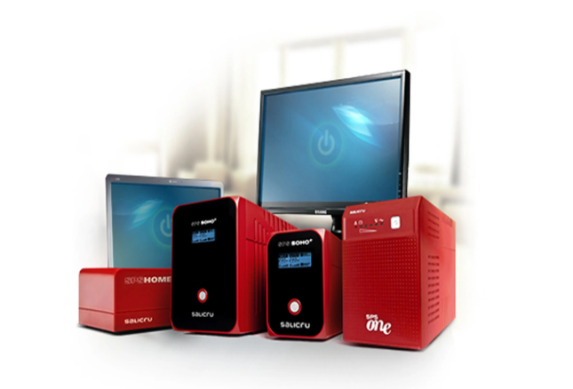
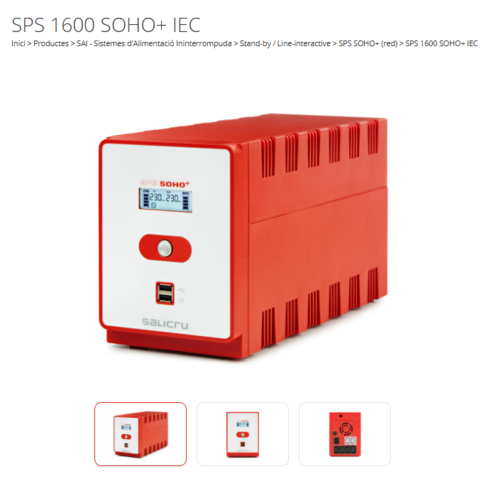
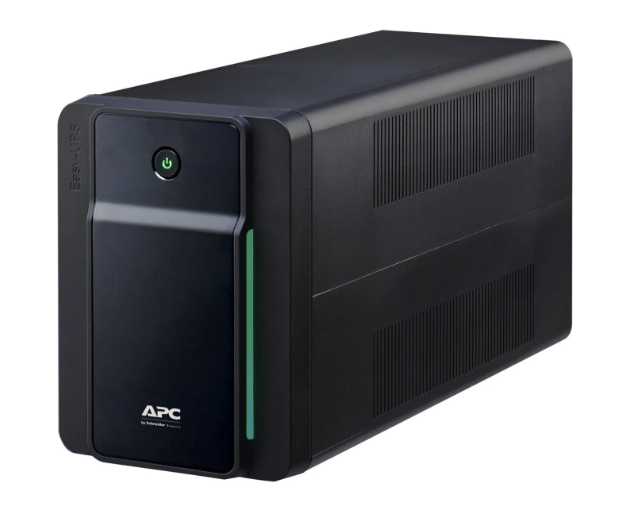
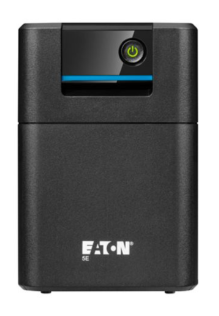

# SELECCIÓ D’UN SAI PER UNA EMPRESA CLIENT

# 1. DESCRIPCIÓ DEL CAS

## Tasques a realitzar  
## 1. Inventari d’equips  
- Llista dels dispositius que es connectaran al SAI (ordinadors, monitors, router, etc.), justifiqueu si hi ha algun aparell que no hi connectareu al sistema d’alimentació ininterrompuda.  
- Consulta de les especificacions tècniques per obtenir el consum de cada dispositiu. Seleccioneu components que s’ajustin als que podríeu trobar-vos a la seu del client. Indiqueu clarament les dades del component triat i els valors de watts i VA corresponents.

| Dispositiu       | Quantitat | Model aproximat          | Consum (W) | Consum (VA) |
|------------------|-----------|-------------------------|------------|-------------|
| Ordinador        | 4         | HP ProDesk 400 G6       | 180 W      | 300 VA      |
| Monitor LED      | 4         | Dell 24" LED            | 25 W       | 35 VA       |
| Router           | 1         | TP-Link Archer C80      | 10 W       | 15 VA       |
| Impressora làser | 1         | HP LaserJet Pro M404dn  | 300 W      | 400 VA      |
| Perifèrics       | 4         | Teclat, ratolí, etc.    | 2 W        | 4 VA        |

## Justificació:  
- Els **perifèrics** (teclat, ratolí, etc.) tenen un consum molt baix i s’alimenten a través dels ordinadors, per això no cal connectar-los directament al SAI.  
- La **impressora** no es connectarà al SAI perquè no és essencial en cas de tall de corrent i també té un consum elevat.

# 2. Càlcul de potència total  
- Valor total de potència i valor incloent la reserva del 20%.

## Dispositius connectats al SAI:  
- Ordinadors: 4 × 180 W = 720 W → 4 × 300 VA = 1200 VA  
- Monitors: 4 × 25 W = 100 W → 4 × 35 VA = 140 VA  
- Router: 10 W → 15 VA  

## Total:  
- **Potència total en watts:** 830 W  
- **Potència total en VA:** 1355 VA  

## Amb reserva del 20%:  
- **Watts amb reserva:** 830 × 1.2 = **996 W**
- **VA amb reserva:** 1355 × 1.2 = **1626 VA**

# 3. Determinació de l’autonomia  
- Estimació del temps mínim que el SAI ha de mantenir els equips en funcionament (ex. 10 minuts per guardar treballs i apagar correctament).

# 4. Recerca de models de SAI  
- Cerca de 2 o 3 models de SAI que compleixin els requisits.  
- Comparació de característiques: potència, autonomia, tipus de sortides, preu, marca.

COMPARACIÓ

| Model                      | Potència (VA/W)      | Autonomia estimada | Sortides      | Preu aprox. | Marca  | Captures |
|----------------------------|---------------------|--------------------|---------------|-------------|--------|-----------|
| Salicru SPS 1600 SOHO+ IEC | 1600 VA / 960 W     | 10-15 minuts       | 4 IEC + USB   | 190 €       | Salicru||
| APC Easy UPS BVX1600LI      | 1600 VA / 900 W     | 10-12 minuts       | 6 IEC C13     | 181 €       | APC    ||
| Eaton 5E Gen2 1600 USB DIN  | 1600 VA / 960 W     | 10-15 minuts       | 4 DIN + USB   | 185 €       | Eaton  ||

# 5. Informe tècnic/Justificació de la selecció final  
Redacció d'un informe amb:  
- Càlculs realitzats  
- Models analitzats  
- Justificació de la selecció final  

# Informe tècnic  
## Càlculs realitzats  
- Potència total necessària: **830 W / 1355 VA**  
- Potència amb reserva del 20%: **996 W / 1626 VA**  
- Autonomia mínima requerida: **10 minuts**  

## Models analitzats  
- **Salicru SPS 1600 SOHO+ IEC:** Tecnologia Line-interactive, sortides IEC, ports USB, bona autonomia.  
- **APC Easy UPS BVX1600LI:** Marca reconeguda, potència adequada, sortides IEC C13.  
- **Eaton 5E Gen2 1600 USB DIN:** Alta eficiència, sortides DIN, bona relació qualitat-preu.

# Justificació de la selecció final  
## Model recomanat: Salicru SPS 1600 SOHO+ IEC  
- Cobreix la potència amb reserva.  
- Ofereix autonomia superior als 10 minuts.  
- Disposa de sortides compatibles i ports USB addicionals.  
- Marca fiable i orientada a entorns professionals.

