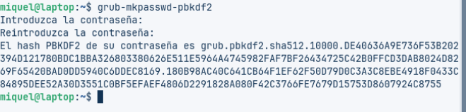
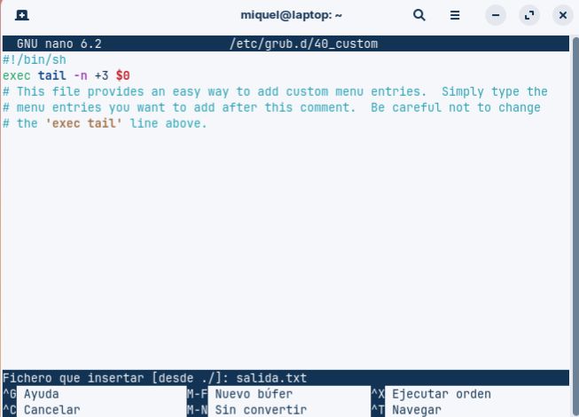
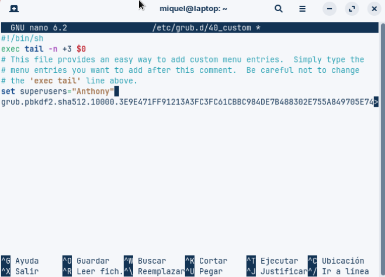
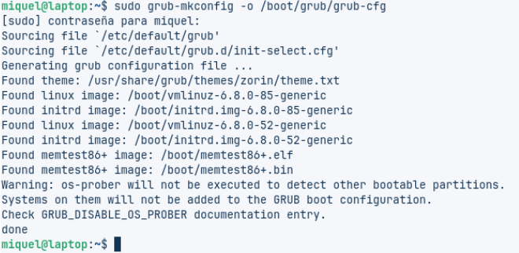
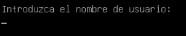

# T03: Seguretat Lògica: recuperant accés a sistemes

- ## Vulneració de l’accés al GRUB del Linux
Creem la nova màquina i posem la ISO.

Al iniciar la màquina fem shift + f (qualsevol tecla) i ens entrarà aquí al menú d'arrencada de Zorin:

- ## Identifiqueu l’usuari del sistema.

- ## Modifiqueu la contrasenya de l’usuari i verifiqueu que ara ja té accés.

- ## Investigueu com es pot fortificar l’accés al GRUB. És molt important que indiquis les fonts d’informació que usis.

## Què és el GRUB:
El GRUB és un gestor d'arrencada que permet triar quin sistema operatiu iniciar quan encenem l'ordinador.

## Per què aquesta necessitat de protegir el GRUB:
Si no està protegit, qualsevol persona amb accés físic pot modificar els paràmetres, entrar com usuari root i controlar completament l'ordinador sense necessitat de contrasenya.

## Com protegir el GRUB?

1. Fer còpia de seguretat dels arxius de configuració.
2. Crear usuaris i contrasenyes per accedir al GRUB (diferents dels usuaris del sistema).
3. Xifrar les contrasenyes amb un hash perquè no estiguin en text pla.
4. Actualitzar la configuració del GRUB perquè apliqui la protecció.
5. Opcionalment, bloquejar l’arrencada d’alguns sistemes operatius sense contrasenya o permetre que alguns es puguin arrencar lliurement (segons la versió de GRUB).

## Més mesures de seguretat:
Protegir el GRUB no és realment suficient, ja que també cal xifrar les particions, protegir la BIOS/UEFI amb contrasenya, també impedir l’arrencada des de dispositius externs i limitar l’accés físic a l’ordinador.

[Font d'informació que he usat](https://geekland.eu/proteger-el-grub-con-contrasena/).

- ## Configura la màquina virtual per tal de fortificar l’accés al GRUB
Ara protegirem el GRUB, posant la següent comanda:

Ara editarem l’arxiu, posem aquesta comanda:                          

Seguidament el guardarem a salida.txt amb control+R.

Ara posarem l’autenticació.

Seguidament posem la següent comanda:

I per finalitzar fem la comprovació.               

[Anar a l'enunciat](../Tasca02/README.md)                 
[Anar a la pàgina inicial](../README.md)

